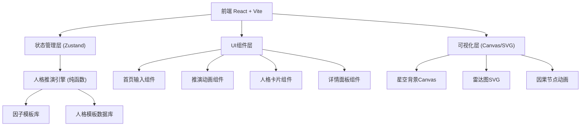

## 1. 架构设计



## 2. 技术说明

- **前端框架**: React@18 + TypeScript
- **构建工具**: Vite@5
- **样式方案**: TailwindCSS@3 + CSS变量主题 + 原生CSS动画
- **状态管理**: Zustand（轻量，避免Redux过度工程化）
- **可视化**: Canvas API（星空背景、粒子动画）+ 原生SVG（雷达图、节点关系）
- **字体**: Google Fonts 引入 Noto Serif SC（思源宋体）+ Noto Sans SC（思源黑体）+ JetBrains Mono
- **后端**: 无（纯前端应用，人格推演逻辑在前端使用内置模板算法完成）
- **数据**: 内置JSON格式的人格因子库、口头禅库、价值观模板、人生选择模板

## 3. 路由定义

| 路由 | 用途 |
|-----|-----|
| / | 首页：输入区 + 参数控制 |
| /simulate | 推演加载动画页 |
| /result | 结果展示：人格卡片 + 详情 + 对比 |

注：使用 React Router 管理路由，也可使用单页状态切换实现（更流畅的动画过渡）。

## 4. 核心数据模型

### 4.1 输入模型

```typescript
interface SimulationInput {
  mode: 'sentence' | 'experience' | 'portrait';
  content: string;
  personalityCount: 3 | 4 | 5;
  factorWeights: {
    family: number;      // 家庭环境权重 0-100
    era: number;         // 时代背景权重 0-100
    education: number;   // 教育经历权重 0-100
    trauma: number;      // 创伤事件权重 0-100
    resources: number;   // 资源禀赋权重 0-100
  };
}
```

### 4.2 平行人格模型

```typescript
interface ParallelPersonality {
  id: string;
  codeName: string;           // 人格代号，如「守夜人」「追风者」
  accentColor: string;        // 主题色
  tagline: string;            // 一句话人格概括
  
  personality: string;        // 性格描述（150-200字）
  catchphrase: string[];      // 口头禅（2-3条）
  values: string[];           // 核心价值观（3-4条）
  lifeChoices: string[];      // 关键人生选择（3-4个节点）
  contradictions: string[];   // 典型内在矛盾（2-3条）
  
  bigFive: {                  // 大五人格维度得分 0-100
    openness: number;
    conscientiousness: number;
    extraversion: number;
    agreeableness: number;
    neuroticism: number;
  };
  
  causalChain: CausalEvent[]; // 因果溯源事件链
}

interface CausalEvent {
  age: number;
  event: string;
  impact: string;             // 对人格的影响描述
}
```

## 5. 人格推演引擎设计

### 5.1 推演流程
1. **输入解析**：从用户输入文本中提取关键词，识别核心人格种子特征
2. **因子采样**：根据用户设置的权重，从因子库中随机采样不同的家庭/时代/教育/创伤/资源组合
3. **人格合成**：将种子特征与环境因子组合，通过模板匹配+规则引擎生成每个人格版本的五维分数
4. **内容生成**：基于五维分数和环境因子，从模板库中组合生成性格描述、口头禅、价值观等文本
5. **因果链构建**：为每个人格版本生成一条5-7个关键事件的时间线，说明人格形成的因果路径

### 5.2 模板库结构
- `factor-templates.json`：家庭/时代/教育/创伤/资源五类因子，每类20-30种变体
- `personality-text-templates.json`：五维人格不同得分区间对应的性格描述模板
- `catchphrase-templates.json`：按人格类型分类的口头禅库
- `life-choice-templates.json`：教育、职业、婚姻、重大决策模板
- `value-systems.json`：价值观体系模板（个人主义/集体主义、理想主义/现实主义等维度）
